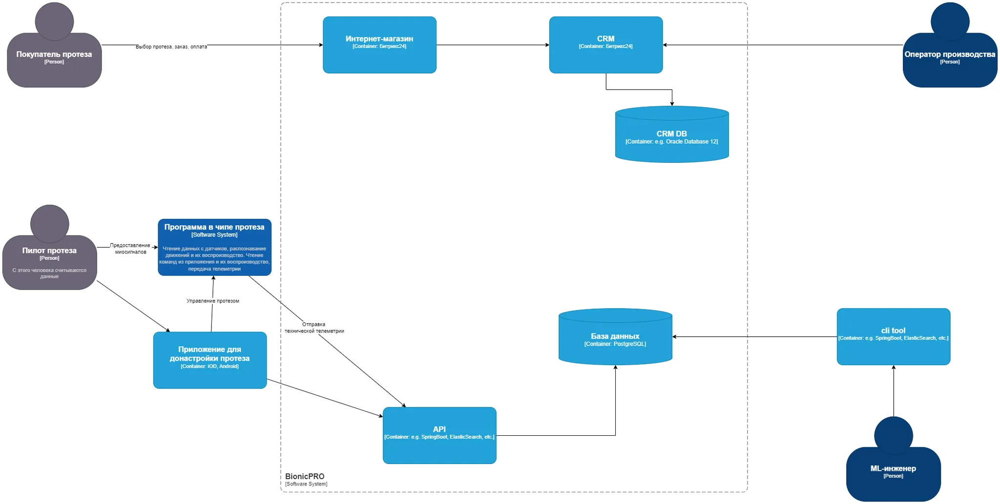
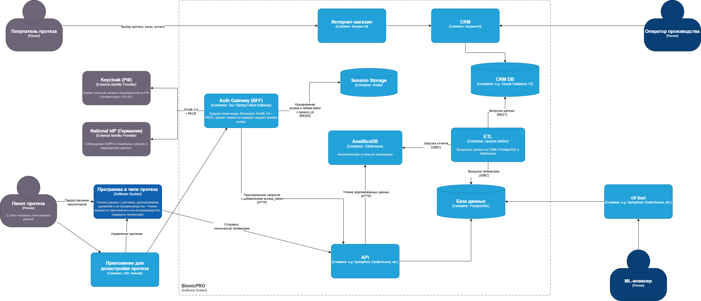
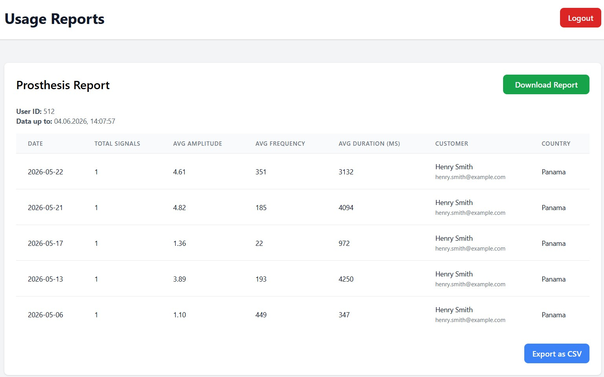

# Кейс 
BionicPRO — компании, которая производит и продаёт бионические протезы.

# Задачи

### Задача 1. 
Разработать архитектурное решение с диаграммой C4 для управления учётными данными пользователя.
Решение должно учитывать и обеспечивать следующие аспекты:
Унификацию доступа в системе BionicPRO. Это будет осуществляться через запрос данных учётных записей из внешнего источника, который расположен в стране представительства компании. Принципы локального хранения персональной и медицинской информации не должны быть нарушены.
Безопасную схему работы с access- и refresh-токенами, которая исключает передачу фронтенду токенов, которые были получены от IdP.
Возможность поддержки аутентификации пользователей через различные внешние удостоверяющие службы, действующие в разных странах.

### Задача 2. 
Улучшить безопасность существующего приложения, реализовав авторизация через PKCE.

### Задача 3. 
Создать архитектуру решения для подготовки и получения отчётов.

Решение должно включать в себя ETL-процесс, который объединяет данные с датчиков и данные из CRM, используя Apache Airflow, и формирует готовую витрину отчётности в OLAP БД. Итоговый отчёт по пользователю должен быть доступен через бэкенд-сервис API, который обозначен на исходной архитектуре.

### Задача 4. 
Разработать Airflow DAG и настроить его на запуск по расписанию.

Реализуйте ETL-процесс с использованием Airflow, который будет извлекать данные из CRM-системы и записывать их в базу OLAP.
Подготовьте витрину — отдельную таблицу для сервиса отчётов, в которой вам предстоит объединить данные телеметрии и данные о клиентах из CRM-системы. Для этого нужно будет сгруппировать аналитику по телеметрии в разрезе клиентов. Спроектируйте структуру витрины таким образом, чтобы обеспечить быстрый доступ к данным по пользователям. За основу при написании DAG можно взять материал уроков спринта.
Настройте расписание сбора данных и подготовки витрины.

### Задача 5. 
Создайте бэкенд-часть приложения для API.
Добавьте API /reports в бэкенд для передачи отчётов, который будет возвращать подготовленный отчёт по заданному пользователю. Отчёт должен запрашиваться из OLAP-базы без необходимости выполнять сложные вычисления в реальном времени.

### Задача 6. 
Реализуйте выгрузку отчетности.
Реализуйте ограничение доступа к эндпоинту отчётности.
Добавьте в UI кнопку получения отчёта и вызова эндпоинта его генерации.
Доступ к отчёту по пользователю должен предоставляться только в отношении себя.

# Диаграммы архитектуры

## AS-IS


## TO-BE


# Запуск

```commandline
docker compose up -d
```

# Окружение

Сайт пользователя: http://localhost:3000

Пользователи для тестирования отчета (которые привязаны по sensor_user_id к тестовым данным с датчиков)
- prothetic1:prothetic123
- prothetic2:prothetic123
- prothetic3:prothetic123

Keycloak: http://localhost:8080 (admin:admin)

BFF: http://localhost:8081/auth/status

Reports API: http://localhost:8000/docs (Swagger)

ClickHouse: http://localhost:8123/play (clickhouse_user:clickhouse_password)

Apache Airflow: http://localhost:8086  (admin:admin)


